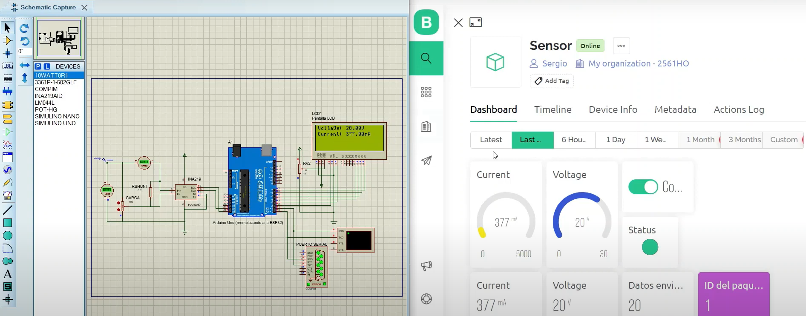

<h1>Solar Panel Array Current and Voltage Measurement Project using INA219 Sensor</h1>

<h2>Description</h2>

This repository contains the code required to utilize the INA219 current and voltage sensor for measuring the current and voltage of a solar panel array. The project is designed to work with an ESP32, which serves as the main controller for collecting and transmitting the measured data in real-time to a Blynk application.

The code provided in this repository is divided into two test versions. In the first version, a simulation in Proteus is used to simulate the connection of an ESP32, allowing for testing the system's functionality without the need for a physical INA219. This facilitates code development and debugging before actual implementation.

The second part of the code focuses on implementation with real physical components. Here, an ESP32 along with the INA219 sensor is used to measure the real-time voltage and current of the solar panel array. These measured data are transmitted through the Blynk application, providing a user-friendly interface to display the measured values and enable remote monitoring.

The main objective of this project is to facilitate accurate and real-time measurement of voltage and current in a solar panel array. This enables efficient monitoring of the system's performance and provides the ability to detect and troubleshoot potential issues.

<h2>Repository Contents</h2>
<ul>
  <li><strong>/Simulation</strong>: Contains the files related to the Proteus simulation that allows testing the code without having a physical INA219. It provides a convenient way to develop and debug the code before actual implementation.</li>
  <li><strong>/Physical Implementation</strong>: Here, you will find the necessary files for the implementation with real physical components. It includes the ESP32 code and connection details for utilizing the INA219 sensor and measuring the voltage and current of the solar panel array.</li>
</ul>
<h2>Usage Instructions</h2>
<ol>
  <li>Clone or download this repository to your computer.</li>
  <code>git clone https://github.com/your-username/repository-name.git</code>
  <li>If you want to test the Proteus simulation, navigate to the <strong>/Simulation</strong> folder and follow the instructions provided in the corresponding README file.</li>
  <li>If you are ready for physical implementation, go to the <strong>/Physical Implementation</strong> folder and follow the detailed instructions provided there. Ensure you have an ESP32 and the INA219 sensor properly connected.</li>
  <li>Configure the Blynk application to receive the measured data and visualize them in real-time. Instructions on how to set up the connection with Blynk will be provided.</li>
</ol>
<h2>Contribution</h2>

If you wish to contribute to this project, you are welcome to do so! You can submit pull requests with improvements, bug fixes, or new functionalities. Please make sure to follow the contribution guidelines established in the repository.

<h2>License</h2>

This project is distributed under the <a href="https://opensource.org/licenses/MIT">MIT License</a>. Please make sure to read and comply with the terms of the license when using this code.

<h2>Contact</h2>

If you have any questions, suggestions, or inquiries related to this project, feel free to contact me through the contact details provided in the repository's profile.

We hope this project proves useful to you in accurately and remotely measuring current and voltage in solar panel arrays. Enjoy and contribute to the sustainable development of solar energy!</p
